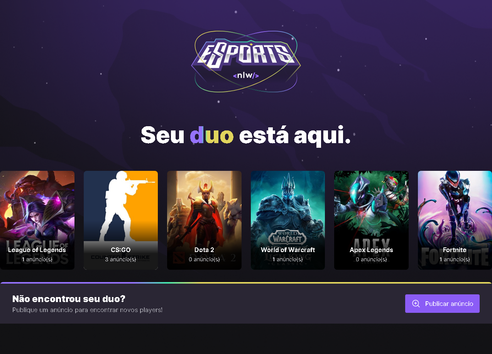
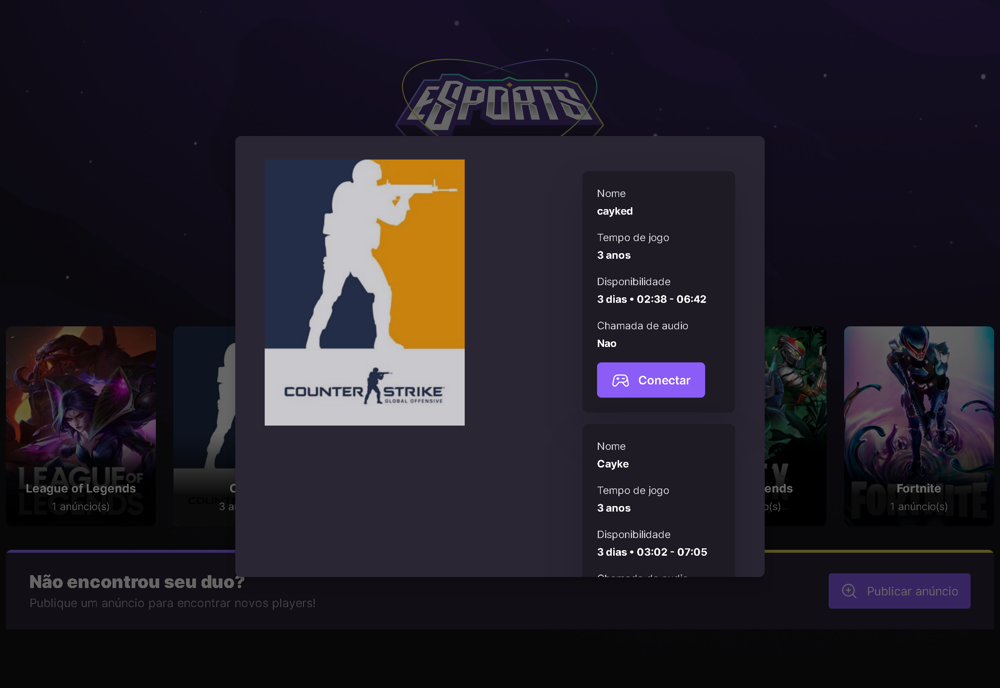
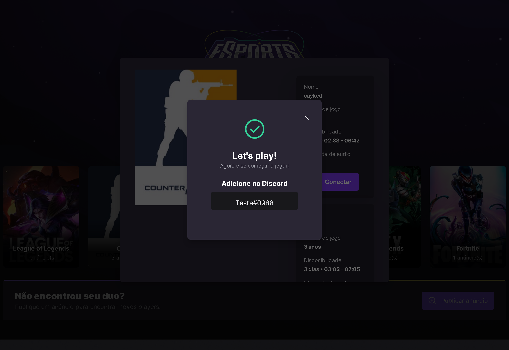
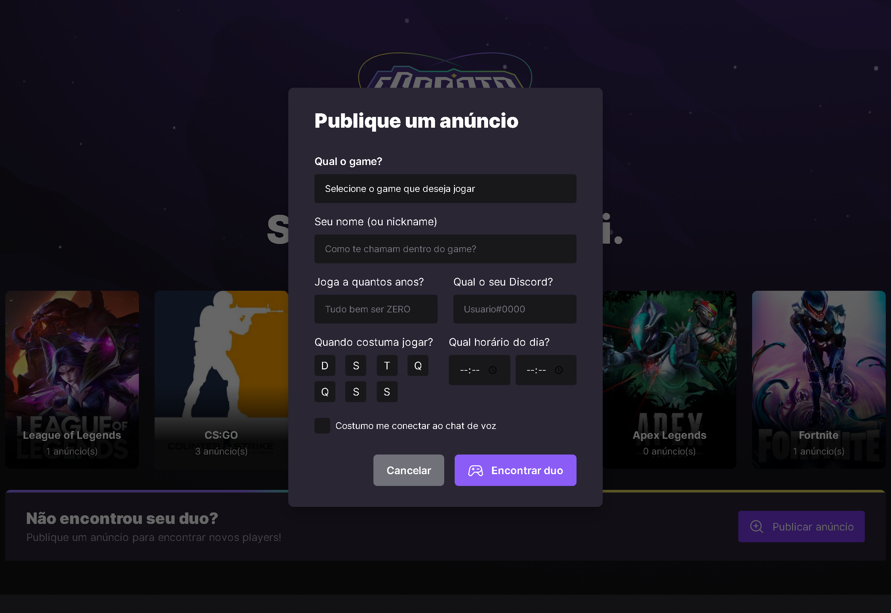

## About Project



It's basically a platform to find a duo in any of the online games listed by posting an ad or meeting someone in an ad. When clicking on any game, you will see a modal with a series of ads, just choose someone who has similar game times to yours and Connect.



The connection interaction opens another modal in which it shows the user's discord and gives the possibility to copy the same.



The option to create an ad is equally simple, it will open a modal that will have several fields, in which the user fills in their information (such as playing hours, for example), after sending the information, just wait for someone to find it.



This project was initially done by rocketseat, at the Nlw event. Using, on the frontend, React, Typescript, Tailwind, Radix, and icon libraries like Phosphor Icons.

## Going Beyond
As I really liked the idea and decided to go a little further, I adjusted the project to work only on the web, adding the discord connection part, filtering the ads by game, and deploying both, the <a href="https://nlw-web-amber.vercel.app/">Front-end</a> and the <a href="https://github.com/cayke1/nlwServer">Server</a>.

## Change project youself
To copy and use/modify this project is very simple.

First, just run git clone in this url
```
git clone https://github.com/cayke1/nlwWeb
```
Install dependencies
```
npm install or yarn
```
And get fun
